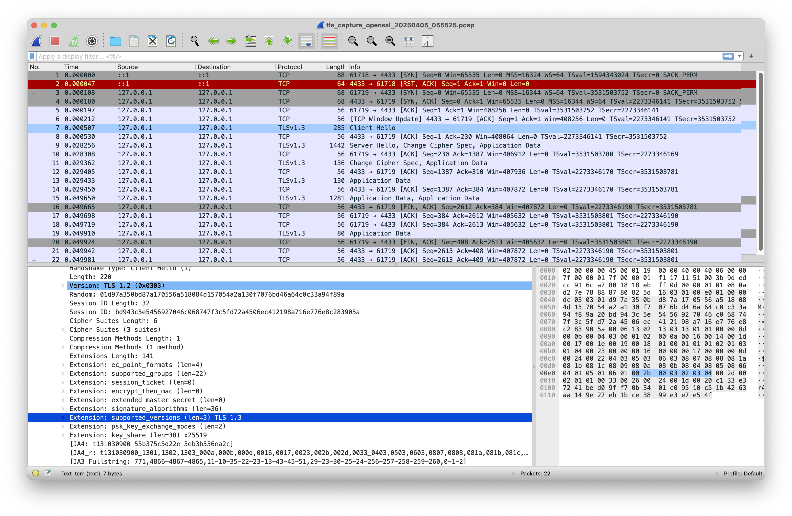

# TruthTLS

我想藉由實作來學習 TLSNotary.

從 FAQ 來看, TLSNotary 目前還沒支援 TLS 1.3 .

另外目前 TLSNotary 的 encryption / decryption 應該是在 MPC 裡面做的. 我想試著改變這一點. 希望能讓計算量降低.
(先前在 TLSNotary discord 的[討論](https://discord.com/channels/943612659163602974/968798323341418547/1351479225454035005))

這是在 [ETHGlobal Taipei 2025](https://ethglobal.com/events/taipei) 的 project.

我會從頭開發一個 minimal 的 TLS 1.3 client. 能多簡陋就多簡陋.

我也沒有時間開發 MPC. 我會把 interface 切出來, 先用 local computation 計算.

能寫多少算多少.

先用中文寫, 最後再叫 AI 翻譯成英文.

----

現在是 5:33.

Client 兩種做法. 寫 code 產生. 拿現成的挖洞.

先選挖洞的.

叫 Github Copilot - Agent - Claude 3.7 Sonnet 來幫忙.

```prompt
幫我寫一個 script.
開一個 local port forwarder 在 port 4433.
用 openssl s_client 透過它去連接 google.com port 443. 送 HEAD request 就好. HTTP/1.1 . 用 TLS 1.3 .
用 tcpdump 把內容 capture 下來. (不用 sudo)
開 wireshark 讓我檢視內容.
```




但是顯然內容太多了. 只要最少的內容
cipher_suite: TLS_AES_128_GCM_SHA256
supported_versions: TLS 1.3
signature_algorithms: rsa_pkcs1_sha256 / rsa_pss_rsae_sha256 / ecdsa_secp256r1_sha256
supported_groups: secp256r1

現在送出的 request 像這樣 (從 wireshark copy hexdump)
```
0000   16 03 01 00 c3 01 00 00 bf 03 03 67 81 67 36 7e
0010   a8 8d c6 18 97 c3 a6 fe d9 f6 55 e5 e8 f2 64 27
0020   7e 12 8d f7 63 5d 4f 52 d8 fa 83 20 bf 12 12 ea
0030   9b 2d 53 6d d6 59 3d 39 c2 0a 39 0b f4 e2 e1 6b
0040   ae 3e e9 e0 39 db 67 34 c1 e2 c8 fb 00 02 13 01
0050   01 00 00 74 00 0b 00 04 03 00 01 02 00 0a 00 04
0060   00 02 00 17 00 0d 00 08 00 06 04 01 08 04 04 03
0070   00 2b 00 03 02 03 04 00 2d 00 02 01 01 00 33 00
0080   47 00 45 00 17 00 41 04 e3 2e 31 55 94 19 7a 08
0090   d8 fe ea 3e af 27 92 d5 10 1d 87 a3 04 f1 2a 87
00a0   aa 4a 52 db 3b 82 76 57 71 6c 35 96 77 f1 00 ce
00b0   61 6e f9 96 a2 62 da 9a f5 63 d4 b6 5f 91 bb 12
00c0   26 17 fd d3 87 ba 60 46
```

16030100c3010000bf0303678167367ea88dc61897c3a6fed9f655e5e8f264277e128df7635d4f52d8fa8320bf1212ea9b2d536dd6593d39c20a390bf4e2e16bae3ee9e039db6734c1e2c8fb0002130101000074000b000403000102000a000400020017000d00080006040108040403002b0003020304002d000201010033004700450017004104e32e315594197a08d8feea3eaf2792d5101d87a304f12a87aa4a52db3b827657716c359677f100ce616ef996a262da9af563d4b65f91bb122617fdd387ba6046

```prompt
我希望有一個 Java method, 可以接受 16030100c3010000bf0303678167367ea88dc61897c3a6fed9f655e5e8f26427
或接受
16 03 01 00 c3 01 00 00 bf 03 03 67 81 67 36 7e
a8 8d c6 18 97 c3 a6 fe d9 f6 55 e5 e8 f2 64 27
這樣的 input string
傳回 byte[]
```


```prompt
幫我新增一個 hexdump 的 util method
給一個 title 和一個 byte[]
印到 stdout
```

```
幫我新增一個 class Client
新增一個不需要參數的 connect() method 在裡面.
把這個 request 送到 google.com port 443
16030100c3010000bf0303678167367ea88dc61897c3a6fed9f655e5e8f264277e128df7635d4f52d8fa8320bf1212ea9b2d536dd6593d39c20a390bf4e2e16bae3ee9e039db6734c1e2c8fb0002130101000074000b000403000102000a000400020017000d00080006040108040403002b0003020304002d000201010033004700450017004104e32e315594197a08d8feea3eaf2792d5101d87a304f12a87aa4a52db3b827657716c359677f100ce616ef996a262da9af563d4b65f91bb122617fdd387ba6046
用基本的 Socket / OutputStream / InputStream / byte[]
讀取所有的 response 到一個 byte[]
然後 hexdump 出來
在最外層捕捉 Exception 轉成 RuntimeException 再 throw
過程中使用 class Utils
```

現在看起來 Client 可以連上 google 並且拿到 response 了.
不過有些東西應該要換掉.
Random: offset 0x43, length 32
Session ID: offset 0x64, length 32
Key share: offset 0xBF, length 65

```prompt
幫我在 class Utils 裡面新增一個能夠拿出 random byte[] 的 method
```

```
幫我在 Client 的 connect() 中,
把 request 的兩段區間代換成 random bytes 之後再送出
"Random": offset (0x43 - 0x38), length 32
"Session ID": offset (0x64 - 0x38), length 32
```

```
幫我寫一個 class Keys
new 出 instance 時就會生出 secp256r1 的 key pair, 存在 public data member 裡
再提供一個 method, 會 return 65 bytes 的 uncompressed key
```

```
幫我寫一個 Java class Keys
new 出 instance 時就會生出 secp256r1 的 key pair, 存在 public data member 裡
再提供一個 method, 會 return 65 bytes 的 uncompressed key

我希望 bigIntegerToBytes 不接受 negative value
如果 integer 轉成 bytes 比 length 長, 就丟 runtime exception

我希望把 method 丟出的 exception 都包裝成 runtime exception
```

```
把 Client 的 request 的最後的 bytes 用 Keys.getUncompressedPublicKey() 的內容取代再送出
```

12:29
要來真的處理 response 了.
先手動抽出原本 dump 的 method 到別處.


```
幫我寫兩個比較 integer 的 method
assertEquals(msg, expected, actual)
assertAtMost(msg, expected, actual)
失敗則丟出 RuntimeException
```

```
幫我寫一個 class TLSRecord
從 java.io.DataInput 讀出資料

資料的 layout 如下. integer 都是 unsigned, big-endian.

struct {
ContentType type; // 1 bytes integer
ProtocolVersion legacy_record_version; // 2 bytes integer, should be 0x0303
uint16 length; // 2 bytes integer, should be at most 2^14
opaque fragment[TLSPlaintext.length]; // "length" bytes 
} TLSPlaintext;

TLSRecord 有兩個 public field, 不用 getter setter:
int type; // from "type"
byte[] data; // from "fragment"
```


```
幫我修改 class TLSRecord
1. 使用 class Utils 的 assert methods 來檢查
2. 新增一個 hexdump(title) method, 使用 Utils 的 hexdump. 也要在 title 顯示 type
3. 不要往外丟 checked exception, 轉成 RuntimeException 再丟
```

```
在 class Client 的 connect() 中, 將 DataInputStream 用迴圈讀出多筆 TLSRecord
每讀一筆 record 就 hexdump 一筆
如果讀完一筆後, 1 秒內沒有新的 available bytes, 就結束程式
```

現在要開始 handle record 的內容了.
在這邊先偷工減料!
跳過 handshake 可能會被切成 fragment 的問題!!!!
也不考慮 coalesce !

```
幫我寫一個 class Handshake
從 java.io.DataInput 讀出資料

資料的 layout 如下. integer 都是 unsigned, big-endian.

      struct {
          HandshakeType msg_type;    /* handshake type */ // 1 byte
          uint24 length;             /* remaining bytes in message */ // 3 bytes
          // "length" bytes
      } Handshake;

讀出成
class Handshake 有下面幾個 public field, 不用 getter setter
int msg_type
int length
byte[] data
```

```
新增一個 Handshake 的 read(byte[]) method, 輸入一個 byte[], 內部包裝一個 DataInputStream 以後,  給原來的 read(DataInput) 處理
```

```
在 Handshake 中新增一個 dump(), 顯示每個 fields
```

```
在 readTLSRecords() 中, 每讀到一個 record, 就判斷是不是 type = 22 (先不要提出 constant)
如果是, 就用 data 生成 Handshake 並 dump
```

終於來到了 ServerHello

```
幫我寫一個 class TLSRecord
從 java.io.DataInput 讀出資料

資料的 layout 如下. integer 都是 unsigned, big-endian.

      struct {
          ProtocolVersion legacy_version = 0x0303;    // 2 bytes. must be 0x0303.
          Random random;                              // 32 bytes[]
          opaque legacy_session_id_echo<0..32>;       // 1 byte length, then byte[length]
          CipherSuite cipher_suite;                   // 2 byte integer
          uint8 legacy_compression_method = 0;        // 1 byte. must be 0
          Extension extensions<6..2^16-1>;            // 2 byte length, then byte[length]
      } ServerHello;
      
讀出成下面的樣子
class ServerHello 有下面幾個 public field, 不用 getter setter
int cipher_suite
byte[] extension_data
```

```
幫我建立 Java 的 class Handshake, 通通建立成 int constant, 維持原來的 naming
enum {
client_hello(1),
server_hello(2),
new_session_ticket(4),
end_of_early_data(5),
encrypted_extensions(8),
certificate(11),
certificate_request(13),
certificate_verify(15),
finished(20),
key_update(24),
message_hash(254),
(255)
} HandshakeType;
```
上面的 prompt 不小心講錯了. 本來想要建立獨立的 class, 現在變成在 Handshake 裡面的 constant 了. 也行.

```
在 class Handshake 的 read() 中, 新增一個 public field 
Object object = null;
如果 msg_type 是 handshake, 就用 data 把 Handshake object 建出來
```

```
幫我寫一個 class Extension
從 java.io.DataInput 讀出資料

資料的 layout 如下. integer 都是 unsigned, big-endian.
struct {
  ExtensionType extension_type;   // 1 byte int
  opaque extension_data<0..2^16-1>; // 2 byte length followed by byte[length]
} Extension;


class Extension 有下面這幾個 public field, 不用 getter setter
int type // from extension_type
byte[] data // from extension_data
```

```
在 ServerHello 中, 把 extension_data 用 loop 讀出一個一個的 Extension object, 存到 List<Extension> extensions
```

```
讓 git ignore "captures"  目錄
```

```
把這些加到 class Extension 變成 int constants
enum {
server_name(0), /* RFC 6066 */
max_fragment_length(1), /* RFC 6066 */
status_request(5), /* RFC 6066 */
supported_groups(10), /* RFC 8422, 7919 */
signature_algorithms(13), /* RFC 8446 */
use_srtp(14), /* RFC 5764 */
heartbeat(15), /* RFC 6520 */
application_layer_protocol_negotiation(16), /* RFC 7301 */
signed_certificate_timestamp(18), /* RFC 6962 */
client_certificate_type(19), /* RFC 7250 */
server_certificate_type(20), /* RFC 7250 */
padding(21), /* RFC 7685 */
pre_shared_key(41), /* RFC 8446 */
early_data(42), /* RFC 8446 */
supported_versions(43), /* RFC 8446 */
cookie(44), /* RFC 8446 */
psk_key_exchange_modes(45), /* RFC 8446 */
certificate_authorities(47), /* RFC 8446 */
oid_filters(48), /* RFC 8446 */
post_handshake_auth(49), /* RFC 8446 */
signature_algorithms_cert(50), /* RFC 8446 */
key_share(51), /* RFC 8446 */
(65535)
} ExtensionType;
```


```
幫我寫一個 class KeyShareEntry
從 java.io.DataInput 讀出資料

資料的 layout 如下. integer 都是 unsigned, big-endian.
struct {
NamedGroup group; // 2 byte integer
opaque key_exchange<1..2^16-1>; // 2 byte length, then byte[length]
} KeyShareEntry;


class KeyShareEntry 有下面這幾個 public field, 不用 getter setter
int group
byte[] key_exchange
```